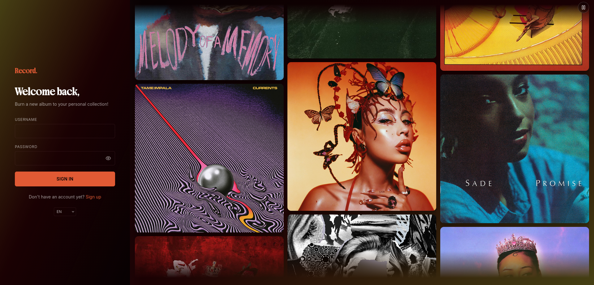
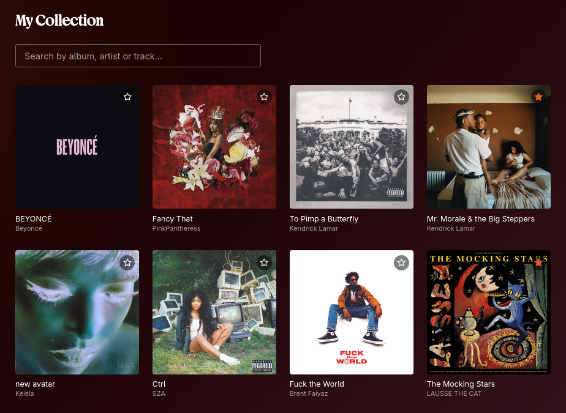
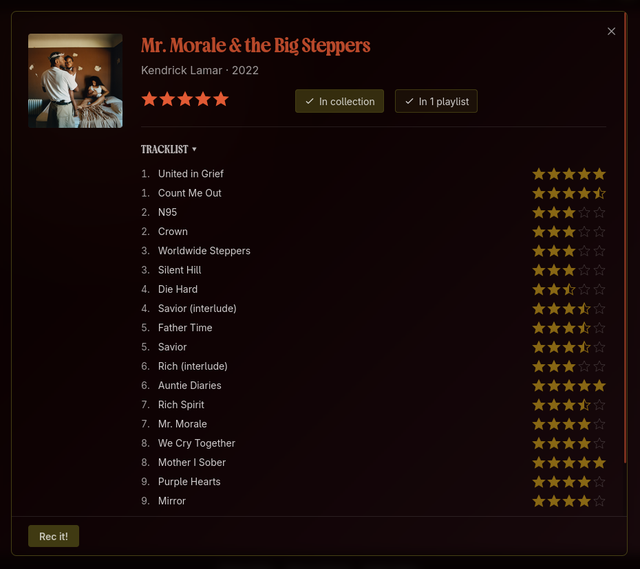

*This project has been created as part of the 42 curriculum by a team of 4 students.*

---
# ♪ Table of Contents

1. [Description](#description)
2. [Instructions](#instructions)
3. [Resources](#resources)
5. [Project Management](#project-management)
6. [Technical Stack & Security](#technical-stack--security)
    - [Technologies and frameworks used](#-technologies-and-frameworks-used)
    - [Infrastructure & Security](#-infrastructure--security)
8. [Features List](#features-list)
11. [Additional Information](#additional-information)

---

---

# ♪ Description

**Record** is a social platform for people who enjoy music and wish to build a safe community around it. It allows users to add their favourite music to their personal collection, rate albums, share their thoughts with friends and wholly express their love for music.

- Manage your profile
- 'Rec' an album and add it to the playlist that suits its mood best
- Follow your friends' activity & chat
- Play a Blind Test alone or with friends to test your musical knowledge

---

# ♪ Instructions

This project requires Docker (engine + CLI + Compose plugin) to be installed and configured on your machine.

### Launching the project

1. Clone/download the repository
2. At the root of the repo, run `make up`
3. Once the build is complete and all containers are `Healthy`/`Started`, access the site via: `https://localhost:8443`

### Useful commands
- `make down` — stops and removes containers
- `make re` — full cleanup, rebuild, and restart
- `make ps` — container status
- `make logs` — live logs
- `make demo` — enables the demo mode by setting up 4 users
- `make inside-[...]` — opens a shell inside the relevant container
---

# ♪ Project Management

◦ We held an initial meeting to divide up tasks and roles and share our respective ideas for the site, followed by a few other meetings on Fridays for weekly check-ins. 

◦ We used Google Docs to track the project's progress. Each group member had a dedicated tab to describe their progress, the necessary documentation for the modules they were working on, and the relevant resources.

◦ We primarily used Discord to communicate with one another. The platform is easy to use and allowed us to create a server for our project, ensuring that every bit of progress was noted in the relevant channels.

---

# ♪ Technical Stack & Security

#### ◦ Technologies and frameworks used

The frontend was built with React.js and Tailwind CSS, while the backend was developed using NestJS, a progressive Node.js framework built with and fully supporting TypeScript. As for the Database, *Record* uses PostgreSQL, an open-source object-relational database management system.

#### ◦ Infrastructure & Security
We chose **Docker** as a containerisation solution because it enables packaging and running an application in a loosely isolated, secure environment called a container.
Every service—Vault, PostgreSQL, Redis, the NestJS backend, nginx, and the backup daemon—runs in its own container with its own Dockerfile and health check.

**✽ Why two networks?**

We split the Docker Compose network into two, ensuring that Vault is accessible only through the backend network and enhancing security within the stack.

- `network-frontend;`frontend + nginx
- `network-backend;` backend, nginx,postgres, vault, redis

The services using the backend network are reachable only from other containers on this private network as they expose no ports.

Nginx is the only service attached to both networks, acting as the single controlled bridge between the public-facing side and the backend services. This ensures that even if the WAF/ModSecurity layer were bypassed, the database, cache, and secrets store are not directly reachable from outside the backend network.

**✽ TLS, HTTPS, secure connection?**

The main connection is secure, relying on TLSv1 and 2 TLSv1.3, which means all API calls and connections are using HTTPS.

- **nginx/browser;** HTTPS only on port 8443, using a certificate by Vault’s PKI engine—there is also no silent HTTP fallback thanks to the port 8080 redirection to https://:8443$host
- **nginx/backend;** internal, HTTP since the backend container has no published port and is unreachable except from containers already on network-backend
- **backend/postgres/redis/vault;** same private network,

HTTPS is enforced from the browser to nginx.  Internal service-to-service traffic relies on Docker network segmentation rather than end-to-end TLS, since these services are never reachable from outside network-backend.

**✽ Why these specific services?**

* `Vault;` centralises secrets (database credentials, Redis password…) and issues the TLS certificate nginx uses
* `nginx;` reverse proxy, TLS termination, and ModSecurity WAF enforcement point

---

# ♪ Features List

Below is a detailed breakdown of all implemented features, their functionality and who worked on them.

#####  ◦ a real-time friends system

*Record* lets users search for other members, send and repsond to friend requests, and block/unblock unwanted contacts. Friend status (acceptance, removal) propagate in real time via Websockets, so both users always see an up-to-date friends list without needing to refresh the page.

##### ◦ real-time chat with rich message types

Users can message their friends directly through a dedicated chat interface built on Socket.IO. Beyond plain text, the chat supports online/offline presence indicators, a live "is typing..." indicator, and read and receipts. Conversations also support rich message cards: users can share an album directly from the music catalogue, or send a Blind Test game invite.

##### ◦ A notification system
The notification system keeps users informed of relevant activity without requiring them to actively check every page.

##### ◦ Search through an extensive collection of music (albums, EPs, singles)

*Record* allows users to dynamically search through an extensive collection of music inside the *Music Brainz / Cover Art* database that is directly incorporated into the backend, thanks to the *Music Brainz / Cover Art* API. Users can type in a title, artist, album title, EPs or singles, then retrieve basic metadata about it (release group, date and artist).

##### ◦ Add digital music to a playlist or a collection

*Record* allows users to visually keep track of their favourite music to make it engaging and more personalised. The collection is a personal feature, similar to real collection of CDs or vinyls, while playlists can be public and visible to friends.

##### ◦ A custom and unique rating system

To guarantee authenticity and full expression of personal taste, *Record* lets users rate music through two different process; as a whole, or track by track for those who pay attention to details in each song and want an honest rating. Reviews are optional, and other users can like these 'Recs' to show appreciation. Notifications allow friends to easily interact with each others' recs.

##### ◦ A blindtest where you can play alone or with friends

*Record* allows users to play a blindtest either solo or with people from their friends list. It features ten 15-second rounds to test everyone's knowledge across a variety of musical genres.
